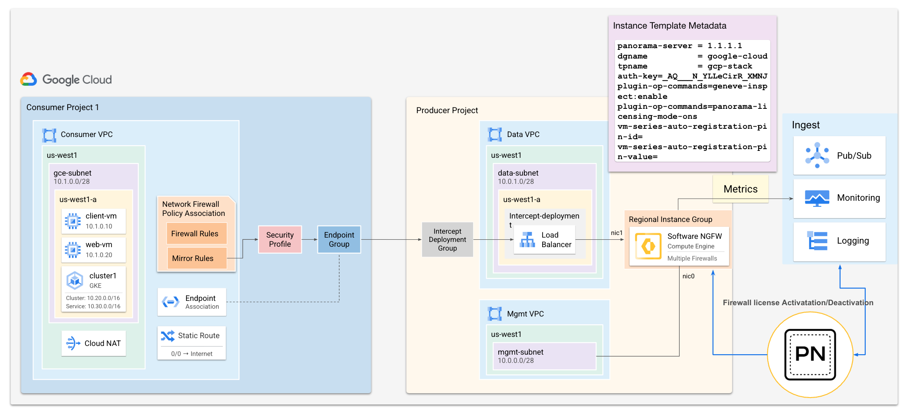
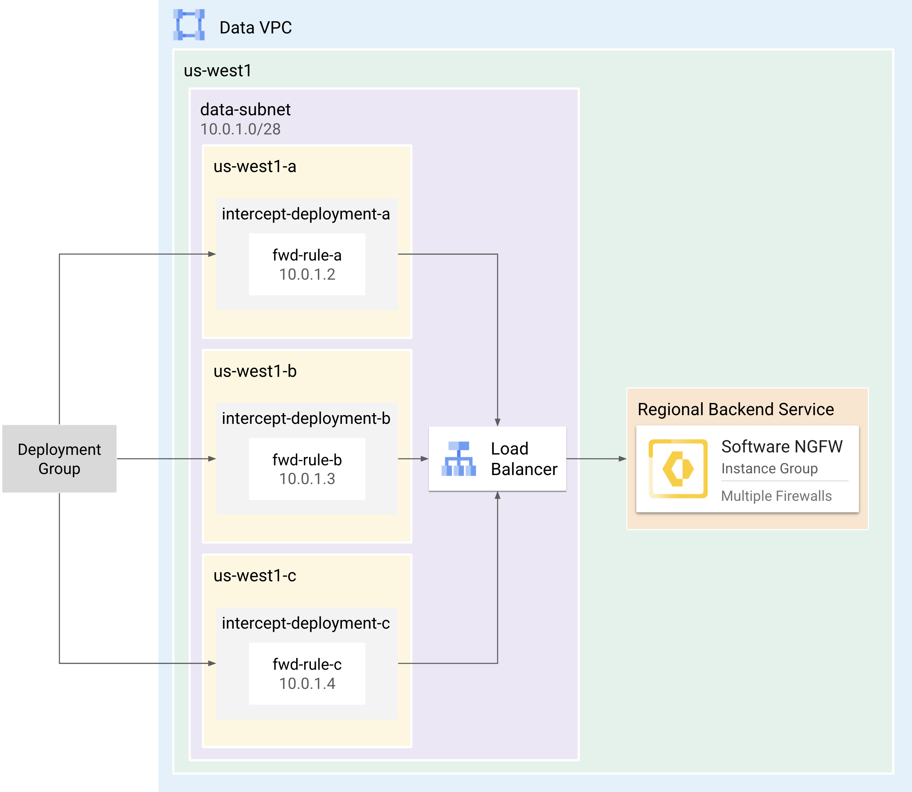
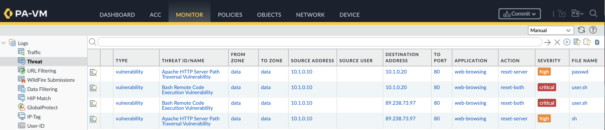

# Autoscaling Software NGFW with Network Security Integration using Panorama


This tutorial shows how to deploy Palo Alto Networks Software Firewalls in Google Cloud, utilizing either the *in-line* or *out-of-band* deployment model within the [Network Security Integration](https://cloud.google.com/network-security-integration/docs/nsi-overview) (NSI). This deployment integrates with **Panorama** for centralized management and uses **Google Cloud Managed Instance Groups** for autoscaling based on custom metrics. NSI enables you to gain visibility and security for your VPC network traffic, without requiring any changes to your network infrastructure.

The functionality of each model is summarized as follows:

| Model           | Description             |
| --------------- | ----------------------- |
| **Out-of-Band** | Uses packet mirroring to forward a copy of network traffic to Software Firewalls for *out-of-band* inspection. Traffic is mirrored to your software firewalls by creating mirroring rules within your network firewall policy. |
| **In-line**     | Uses packet intercept to steer network traffic to Software Firewalls for *in-line* inspection. Traffic is steered to your software firewalls by creating firewall rules within your network firewall policy. |

This tutorial is intended for network administrators, solution architects, and security professionals who are familiar with Panorama, [Compute Engine](https://cloud.google.com/compute), and [Virtual Private Cloud (VPC) networking](https://cloud.google.com/vpc).


<br>

## Architecture

This architecture integrates Panorama for centralized firewall management, licensing, and metric collection. NSI follows a *producer-consumer* model, where the *consumer* consumes services provided by the *producer*. The *producer* contains the cloud infrastructure responsible for inspecting network traffic, while the *consumer* environment contains the cloud resources that require inspection. The producer utilizes a Managed Instance Group that autoscales based on metrics published by the VM-Series firewalls to Google Cloud Monitoring.



### Producer Components

The producer creates firewalls which serve as the backend service for an internal load balancer. For each zone requiring traffic inspection, the producer creates a forwarding rule, and links it to an *intercept* or *mirroring* *deployment* which is a zone-based resource. These are consolidated into an *deployment group*, which is then made accessible to the consumer.

| Component | Description |
| :---- | :---- |
| [Load Balancer](https://cloud.google.com/network-security-integration/docs/out-of-band/configure-producer-service#create-int-lb-pm) | An internal network load balancer that distributes traffic to the NGFWs. |
| [Deployments](https://cloud.google.com/network-security-integration/docs/out-of-band/deployments-overview) | A zonal resource that acts as a backend of the load balancer, providing network inspection on traffic from the consumer. |
| [Deployment Group](https://cloud.google.com/network-security-integration/docs/out-of-band/deployment-groups-overview) | A collection of intercept or mirroring deployments that are set up across multiple zones within the same project.  It represents the firewalls as a service that consumers reference. |
| [Instance Group](https://cloud.google.com/compute/docs/instance-groups) | A managed or unmanaged instance group that contains the firewalls which enable horizontal scaling. |


#### Zone Affinity Considerations

The internal load balancer supports Google Cloud's **Zonal Affinity** feature on its regional backend service, which allows you to keep traffic within the local zone or control how it spills over to other zones.

The supported configurations are:
* **ZONAL_AFFINITY_STAY_WITHIN_ZONE**: Ensures traffic is inspected by a firewall in the same zone as the consumer's source zone.
* **ZONAL_AFFINITY_SPILL_CROSS_ZONE**: Allows traffic to be inspected by firewalls in the local zone, but can spill over to other zones if the ratio of healthy backends falls below a defined threshold (configured with a `spillover_ratio`).

For the demo codes in this project, we configure the **Cross-Zone** based deployment to use **ZONAL_AFFINITY_SPILL_CROSS_ZONE** with a `spillover_ratio` of `0.8`. This ensures that traffic prefers firewalls in the local zone but can spill over to other zones within the region if less than 80% of the local firewalls are healthy.

<table>
    <!-- Title cell with left alignment -->
    <th colspan="2" align="left">Cross-Zone Deployment</th>
  </tr>
  <tr>
    <td width="35%"></td>
    <td width="65%">
      <ol>
        <li>Deploy the firewalls to a regional instance group matching the source region of the consumer.</li>
        <li>Add the instance group to a backend service.</li>
        <li>Create a forwarding rule targeting the backend service.</li>
        <li>Link the forwarding rule to an intercept/mirroring deployment matching the zone you wish to inspect.</li>
        <li>Add the deployment to the deployment group.</li>
        <li><b>Repeat steps 3-5</b> for each zone requiring inspection.</li>
      </ol>
    </td>
  </tr>
</table>

<br>

### Consumer Components

The consumer creates an *intercept* or *mirroring* *endpoint group* corresponding to the producer's *deployment group*. Then, the consumer associates the endpoint group with VPC networks requiring inspection. 

Finally, the consumer creates a network firewall policy with rules that use a *security profile group* as their action.  Traffic matching these rules is intercepted or mirrored to the producer for inspection.

| Component | Description |
| :---- | :---- |
| [Endpoint Group](https://cloud.google.com/network-security-integration/docs/out-of-band/endpoint-groups-overview) | A project-level resource that directly corresponds to a producer's deployment group. This group can be associated with multiple VPC networks. |
| [Endpoint Group Association](https://cloud.google.com/network-security-integration/docs/out-of-band/configure-mirroring-endpoint-group-associations) | Associates the endpoint group to consumer VPCs. |
| [Firewall Rules](https://cloud.google.com/firewall/docs/network-firewall-policies) | Exists within Network Firewall Policies and select traffic to be intercepted or mirrored for inspection by the producer. |
| [Security Profiles](https://cloud.google.com/network-security-integration/docs/security-profiles-overview) | Can be type `intercept` or `mirroring` and are set as the action within firewall rules. |

<br>

### Auto Scaling Components

Use the GCP VM Series plugin in the VM Series, to create and publish VM Series metrics, working with Google Monitoring and Loggings. Google Managed Instance Group will monitor these metrics and auto scale out and in based on your definition. The Software Firewall License Plugin will manage the firewall instances in the Instance group licensing and delicensing. Refer to the [link](https://docs.paloaltonetworks.com/vm-series/11-1/vm-series-deployment/license-the-vm-series-firewall/use-panorama-based-software-firewall-license-management
) for details.
The following bootstrap parameters in `init-cfg.txt` are used to configure the firewall's connection to Panorama and enable license management:

| Parameter | Description |
| :---- | :---- |
| `panorama-server` | IP address or FQDN of the Panorama server. |
| `tplname` | Panorama template stack name for the firewall configuration. |
| `dgname` | Panorama device group name for the firewall. |
| `auth-key` | The authorization key used to register the firewall with Panorama. |
| `plugin-op-commands=panorama-licensing-mode-on` | Enables the Software Firewall License Plugin to manage the firewall license. |
| `vm-series-auto-registration-pin-id` | The firewall registration PIN ID for installing the device certificate onto the firewall. |
| `vm-series-auto-registration-pin-value` | The firewall registration PIN Value for installing the device certificate onto the firewall. |


## Requirements


1. A Google Cloud project.
2. Access to [Cloud Shell](https://shell.cloud.google.com). 
3. The following IAM Roles:

    | Ability | Scope | Roles |
    | :---- | :---- | :---- |
    | Create [firewall endpoints](https://cloud.google.com/firewall/docs/about-firewall-endpoints#iam-roles), [endpoint associations](https://cloud.google.com/firewall/docs/about-firewall-endpoints#endpoint-association), [security profiles](https://cloud.google.com/firewall/docs/about-security-profiles#iam-roles), and [network firewall policies](https://cloud.google.com/firewall/docs/network-firewall-policies#iam). | Organization | `compute.networkAdmin`<br>`compute.networkUser`<br>`compute.networkViewer` |
    | Create [global network firewall policies](https://cloud.google.com/firewall/docs/use-network-firewall-policies#expandable-1) and [firewall rules](https://cloud.google.com/firewall/docs/use-network-firewall-policies#expandable-8) for VPC networks. | Project | `compute.securityAdmin`<br>`compute.networkAdmin`<br>`compute.networkViewer`<br>`compute.viewer`<br>`compute.instanceAdmin` |


<br>

## Create Producer Environment
In the `producer` directory, use the terraform plan to automatically create the producer's VPCs, instance template, instance group, internal load balancer, NSI intercept deployment group, and NSI intercept deployment.

> [!TIP]
> In production environments, it is recommended to deploy the producer resources to a dedicated project.  This ensures the security services are managed independently of the consumer.

> [!CAUTION]
> It is required to make your cloudshell git support large file download, run below command to install git lfs before you start to clone the source code.
  
    sudo apt install git-lfs


1. In [Cloud Shell](https://shell.cloud.google.com), clone the repository change to the `producer` directory. 

    ```
    git clone https://github.com/PaloAltoNetworks/google-cloud-nsi-autoscaling-panorma.git
    cd google-cloud-nsi-autoscaling-panorma/producer
    ```

2. Create a `terraform.tfvars`.

    ```
    cp terraform.tfvars.example terraform.tfvars
    ```

3. Edit `terraform.tfvars` by setting values for the following variables:  
   
    | Variable | Description | Default |
    | :---- | :---- | :---- |
    | `project_id` | The Google Cloud project ID of the producer environment. | `null` |
    | `mgmt_allow_ips` | A list of IP addresses to be added to the management network's ingress firewall rule. | `null` |
    | `mgmt_public_ip` | If true, a public IP will be set on the management interface. | `false` | 
    | `region` | The region to deploy the producer resources. | `us-west1` |
    | `image_name` | Name of the firewall image within the paloaltonetworksgcp-public project. | `vmseries-flex-bundle2-1114`|
    | `mirroring_mode` | If true, configures the forwarding rule for packet mirroring. If false, configures it for in-band traffic. | `false` |


> [!CAUTION]
> It is recommended to set `mgmt_public_ip` to `false` in production environments.

> [!TIP]
> For `image_name`, a full list of public images can be found with this command:
> ```
> gcloud compute images list --project paloaltonetworksgcp-public --no-standard-images
> ```
> All NSI deployments require PAN-OS 11.2.x or greater.

> [!NOTE]
> If you are using BYOL image (i.e.  <code>vmseries-flex-<b>byol</b>-*</code>), the license can be applied during or after deployment.  To license during deployment, Panorama SW Firewall License plugin can help you to auto license your SW Firewall. By input: ***auth-key=""*** and ***plugin-op-commands=panorama-licensing-mode-on*** in the init-cfg.txt. Refer to the [Site](https://docs.paloaltonetworks.com/vm-series/activation-and-onboarding/vm-series-firewall-licensing/use-panorama-based-software-firewall-license-management).


4. Initialize and apply the terraform plan.

    ```
    terraform init
    terraform apply
    ```

    Enter `yes` to apply the plan.

5. After the apply completes, terraform displays the following message:

    <pre>
    <b>DEPLOYMENT_GROUP</b> = <i>"projects/your-project-id/locations/global/interceptDeploymentGroups/your-deployment-group"</i>
    <b>PRODUCER_PROJECT</b> = <i>"your-project-id"</i></pre>


> [!IMPORTANT] 
> The `init-cfg.txt` includes `plugin-op-commands=geneve-inspect:enable` bootstrap parameter, allowing firewalls to handle GENEVE encapsulated traffic forwarded via packet intercept. 
> If this is not configured, packet intercept traffic will be dropped. 

<br>

---

# ***On the Consumer project***

## Create Consumer Environment

In the `consumer` directory, use the terraform plan to create a consumer environment. The terraform plan automatically creates a VPC (`consumer-vpc`), two debian VMs (`client-vm` & `web-vm`), an optional GKE cluster (`cluster1`), as well as the necessary NSI components: Endpoint Group, Endpoint Group Association, Security Profile, Security Profile Group, and Global Network Firewall Policy with rules.

> [!NOTE]
> The Endpoint Group is associated with the Deployment Group created in the Producer project. Ensure you have the producer project ID and deployment group ID from the previous steps.

1. In Cloud Shell, change to the `consumer` directory.

    ```
    cd
    cd google-cloud-nsi-autoscaling-panorma/consumer
    ```

2. Create a `terraform.tfvars`

    ```
    cp terraform.tfvars.example terraform.tfvars
    ```

3. Edit `terraform.tfvars` by setting values for the following variables:  
   

    | Variable | Description | Default |
    | :---- | :---- | :---- |
    | `project_id` | The deployment project ID. | `null` |
    | `mgmt_allow_ips` | A list of IP addresses to be added to the consumer network's ingress firewall rule. | `null` |
    | `region` | The region for the deployment. | `us-west1` |
    | `create_gke` | Whether to create the GKE cluster. | `true` |
    | `producer_project_id` | Project ID of the producer environment. | `null` |
    | `producer_dg` | The fully qualified ID of the Deployment Group in the producer project. | `null` |
    | `mirroring_mode` | If true, configures the endpoint group for packet mirroring. If false, configures it for in-band traffic. | `false` |

4. Initialize and apply the terraform plan.

    ```
    terraform init
    terraform apply
    ```

    Enter `yes` to apply the plan.

5. After the apply completes, terraform displays the following message:

    <pre>
    CONSUMER_PROJECT=<i>your-project-id</i>
    CONSUMER_VPC=<i>consumer-vpc</i>
    REGION=<i>us-west1</i>
    ZONE=<i>us-west1-a</i>
    CLIENT_VM=<i>client-vm</i>
    CLUSTER=<i>cluster1</i></pre>

<br>

## Test Inspection

Test inspection by generating pseudo-malicious traffic between VMs and also between VMs and the internet.  Then, generate pseudo-malicious traffic within the GKE cluster (`cluster1`) to test pod-to-pod inspection.

### GCE Inspection
Simulate pseudo-malicious traffic for both east-west and north-south traffic flows.

1. In Cloud Shell, remotely generate pseudo-malicious traffic on the `client-vm` to simulate malicious traffic to the `web-vm` (east/west) and to the `internet` (north/south).

    ```
    export CLIENT_VM=<The output of above CLIENT_VM>
    ```
    ```
    gcloud compute ssh $CLIENT_VM \
        --zone $ZONE \
        --tunnel-through-iap \
        --command="bash -s" << 'EOF'
    curl -s -o /dev/null -w "%{http_code}\n" http://www.eicar.org/cgi-bin/.%2e/.%2e/.%2e/.%2e/bin/sh --data "echo Content-Type: text/plain; echo; uname -a" --max-time 2
    curl -s -o /dev/null -w "%{http_code}\n" http://www.eicar.org/cgi-bin/user.sh -H "FakeHeader:() { :; }; echo Content-Type: text/html; echo ; /bin/uname -a" --max-time 2
    curl -s -o /dev/null -w "%{http_code}\n" http://10.1.0.20/cgi-bin/user.sh -H "FakeHeader:() { :; }; echo Content-Type: text/html; echo ; /bin/uname -a" --max-time 2
    curl -s -o /dev/null -w "%{http_code}\n" http://10.1.0.20/cgi-bin/.%2e/.%2e/.%2e/.%2e/etc/passwd --max-time 2
    EOF
    ```

    (output)
    
    <pre>
    <b>000
    000 
    000
    000</b></pre>

    > The `000` response codes indicate that the traffic was blocked by the producer. 
    > The *out-of-band* deployment will not produce `000` response codes since it is only monitoring the traffic.


2. Retrieve the firewall’s management address.

    ```
    gcloud compute instances list \
        --filter='tags.items=(panw-tutorial)' \
        --format='table[box,title="Firewall MGMT"](networkInterfaces[0].accessConfigs[0].natIP:label=EXTERNAL_IP, networkInterfaces[0].networkIP:label=INTERNAL_IP)'
    ```

3. Access the firewall’s web interface using the management address.

    <pre>
    https://<b><i>MGMT_ADDRESS</i></b></pre>
    Username:
    ```
    admin
    ```
    Password:
    ```
    PaloAlto@123
    ```
---

4. On the firewall, go to **Monitor → Threat** to confirm the firewall prevented the north/south and east/west threats generated by the `client-vm` .

    

<br>


## **Optional: VM-Series Golden Image on GCP**

In high-scale cloud environments, Time-to-Traffic is a critical metric. When scaling out firewalls horizontally, relying on Panorama or startup scripts to download and install Content Updates (Apps & Threats, Antivirus) introduces significant latency—often adding 5–10 minutes to the boot process.

By using a Golden Image, you "bake" the required PAN-OS version and signature sets directly into the virtual disk. This ensures that new instances are functional and passing traffic with the correct security posture immediately upon booting, bypassing the slow content check and download phases.

## 

**1\. Preparation Phase (Base VM)**

Before capturing an image, you must prepare a "Base VM" that contains all the global settings you want your fleet to inherit.

1. **Deploy:** Launch a standard VM-Series instance from the GCP Marketplace.  
2. **Update PAN-OS:** Upgrade to your target version (e.g., 10.2.x, 11.1.x).  
3. **Install Content:** Download and install the latest **Applications and Threats** and **Antivirus** signatures.  


## 

**2\. Generalization Phase (CLI)**

Generalization strips the instance-specific "personality" (logs, local admin accounts, and unique keys) while keeping the PAN-OS system files and content updates intact.

1. Log into the **CLI** of the VM-Series firewall.  
2. Execute the reset command:  
    ```
   admin@PA-VM\> request system private-data-reset
    ```
3. **Confirm** the prompt. The system will now wipe local data and reboot.  
4. **CRITICAL:** Once the VM starts rebooting, **do not log back into it**. If you log in, the system recreates local state files, and the image will no longer be "clean."

##

**3\. Capture Phase (gcloud CLI)**

Once the firewall has finished its reset and is sitting at the login prompt (monitor via GCP Serial Console), use the following commands to create the image.

### **A. Stop the Instance**

The VM must be stopped to ensure disk consistency during the image creation process.

```
gcloud compute instances stop \[BASE\_VM\_NAME\] \--zone \[ZONE\]
```

### **B. Identify the Source Disk**

Locate the disk name attached to your Base VM:

```
gcloud compute instances describe \[BASE\_VM\_NAME\] \\  
    \--zone \[ZONE\] \\  
    \--format="value(disks\[0\].source)"
```

### **C. Create the Custom Image**

Using an \--family is highly recommended. It allows your CI/CD pipelines or Terraform scripts to always pull the "latest" version without hardcoding a specific image name.

```
gcloud compute images create \[IMAGE\_NAME\] \\  
    \--source-disk=\[SOURCE\_DISK\_NAME\] \\  
    \--source-disk-zone=\[ZONE\] \\  
    \--family=\[IMAGE\_FAMILY\_NAME\] \\  
    \--storage-location=\[LOCATION\] \\  
    \--description="Palo Alto Golden Image \- PAN-OS \[VERSION\] \- Generalized"
```
**Example Command:**

```
gcloud compute images create palo-v11-golden-v1 \\  
    \--source-disk=palo-base-disk \\  
    \--source-disk-zone=us-east1-b \\  
    \--family=palo-v11-prod \\  
    \--storage-location=us
```
##


**\. Deployment Best Practices**

When you spin up a new VM from this Golden Image, keep the following in mind:

* **Initial Credentials:** The firewall will revert to default.  
* **Licensing:** \* **PAYG:** Licensing is automatic based on the marketplace billing string.  
  * **BYOL:** You would use the Panorama licensing plugins to manage the license.  
* **Use the Golden Image**: Replace the standard images in the producer project terraform code variable (full image name path is required).

##


# (Optional) Deletion

## On the Consumer Project:

  1. Run `terraform destroy` from the `consumer` directory.

        ```
        cd google-cloud-nsi-autoscaling-panorma/consumer
        terraform destroy
        ```

  2. Enter `yes` to delete all consumer resources.

## On the Producer Project:

  1. Run `terraform destroy` from the `producer` directory.

        ```
        cd google-cloud-nsi-autoscaling-panorma/producer
        terraform destroy
        ```

  2. Enter `yes` to delete all producer resources.
